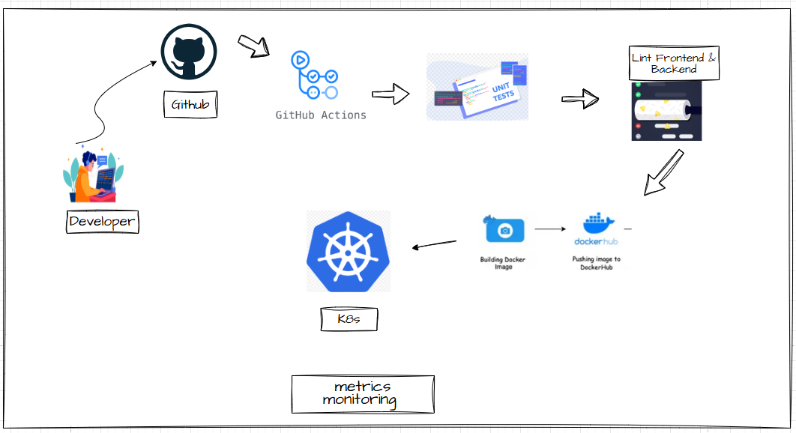

# Metrics Dashboard Project

A full-stack metrics monitoring application with backend microservice, frontend dashboard, containerization, local Kubernetes deployment, and CI/CD automation.

---

## Table of Contents
1. [Project Overview](#project-overview)
2. [Tech Stack](#tech-stack)
3. [Architecture](#architecture)
4. [Getting Started](#getting-started)
5. [Application Details](#application-details)
   - [Backend Microservice](#backend-microservice)
   - [Frontend Dashboard](#frontend-dashboard)
6. [Containerization](#containerization)
7. [Kubernetes Deployment (Local)](#kubernetes-deployment-local)
8. [CI/CD Pipeline](#cicd-pipeline)

---

## Project Overview

This project demonstrates a complete metrics monitoring system:

- **Backend**: Provides simulated metrics via a `/metrics` endpoint.
- **Frontend**: Displays metrics on a dashboard that updates every 10 seconds.
- **Containerization**: Dockerized backend and frontend for consistent environments.
- **Kubernetes Deployment**: Local deployment using `k3s`, `minikube`, or `kind`.
- **CI/CD**: Automated tests, linting, Docker image builds, and Kubernetes deployment via GitHub Actions.

---

## Tech Stack

| Component        | Technology Options                   |
|-----------------|-------------------------------------|
| Backend          | Python, Node.js                  |
| Frontend         | React, Angular, Vue                  |
| Containerization | Docker, Docker Compose               |
| Orchestration    | Kubernetes (k3s / minikube / kind) |
| CI/CD            | GitHub Actions         |

---

## Architecture


 
- Backend exposes `/metrics` endpoint.
- Frontend polls the backend every 05s and displays metrics on cards and graphs.
- Docker Compose allows local testing.
- Kubernetes manifests deploy services with proper resources, probes, and namespaces.
- CI/CD automates build, test, and deploy processes.

---

## Getting Started

### Prerequisites

- Docker & Docker Compose
- Node.js & npm (for frontend)
- Local Kubernetes cluster (`k3s`, `minikube`, or `kind`)
- kubectl configured for local cluster

### Local Setup

```bash
# Clone repository
git clone https://github.com/Deshmukhroshan/Infilect-Assignment.git
cd Infilect-Assignment

# Start services locally with Docker Compose
docker-compose up –build

Application Details
Backend Microservice
•	Endpoint: /metrics
•	Output (JSON):
o	3+ unique simulated metrics (e.g., CPU usage, latency, memory)
o	1 dynamically increasing counter
Example Response:
{
  "cpu": 42.7,
  "latency": 120,
  "memory": 512,
  "requests_count": 15
}
________________________________________
Frontend Dashboard
•	Polls /metrics every 10 seconds
•	Displays metrics as:
•	Metric cards
•	Responsive UI for multiple screen sizes
________________________________________
Containerization
Docker
•	Separate Dockerfiles for backend & frontend
•	Multi-stage builds & .dockerignore implemented

Docker Compose
•	docker-compose.yml orchestrates backend + frontend for local testing
docker-compose up --build
________________________________________
Kubernetes Deployment (Local)
•	Use any local Kubernetes distribution (k3s, minikube, kind)
•	Includes:
•	Deployment & Service manifests
•	Liveness & Readiness probes
•	CPU/memory requests & limits
•	Namespaces & labels for organization
•	Services exposed via NodePort for local access
kubectl apply -f .
________________________________________
CI/CD Pipeline
Configured using GitHub Actions:
•	Triggered on PRs and merges to main
•	Steps:
1.	Run unit tests
2.	Lint backend & frontend
3.	Build Docker images
4.	Push images to Docker Hub or GHCR
5.	Apply Kubernetes manifests to local cluster
•	Sensitive values stored in GitHub Secrets
Sample Workflow File: .github/workflows/deploy.yml
________________________________________
## Accessing Services & Troubleshooting

Frontend: http://localhost:3000
Backend: http://localhost:8000/metrics

Kubernetes (Local Cluster)
kubectl apply -f .
kubectl get svc -n <namespace>
kubectl get pods -n <namespace>
kubectl logs <pod-name> -n <namespace>
kubectl logs -f <pod-name> -n <namespace> # stream logs
________________________________________
